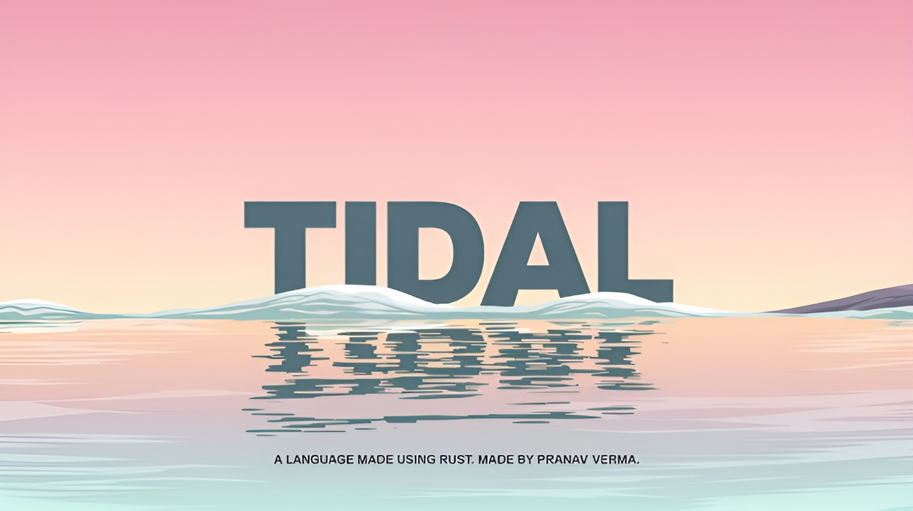
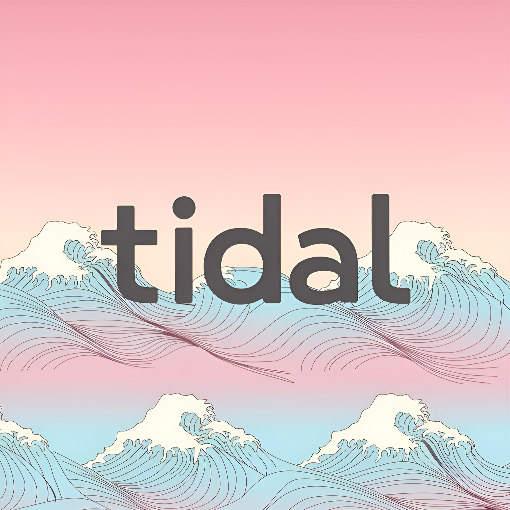

# Tidal
https://tidal.pranavv.site

  <br>
<i>PS, I have just changed the Name of the Programming Language from `Blue Lagoon` to `Tidal`, so, if you see Blue Lagoon written anywhere, just know, it was the old name of the Language!</i>

A Language Made using Rust. <br>
Made by Pranav Verma.

## Download
The Latest Compiled Build Can Be Found in the [Releases](https://github.com/PranavVerma-droid/Blue-Lagoon/releases) (For Windows and Linux)

## File Extensions
- `.td`: Tidal source files.
- `.br`: Another extension for Tidal source files.

## Features
- **Simple Syntax**: Easy-to-read and write syntax.
- **Basic Data Types**: Supports integers, floats, strings, booleans, and null.
- **Control Structures**: Includes `if-else` statements and `for` loops.
- **String Operations**: Supports concatenation, repetition, and indexing.
- **Type Checking and Conversion**: Functions for type checking and conversion.
- **Comments**: Supports block comments for better code documentation.

## Documentation
For detailed documentation, syntax, and examples, please check the [Wiki](https://github.com/PranavVerma-droid/Tidal/wiki).

## Syntax
The Sample Code Along with the Basic Syntax Can be Found in the [Code](code) Directory.

## Development (Linux or WSL)

### Dependencies
```chmod +x scripts/install.sh``` <br>
```./scripts/install.sh```

### Compile
```cargo build --release``` <br>

### Run
```./td <FILENAME.td> -v```

OR 

```./td <FILENAME.br> -v```


